# RescueEye — System Architecture

Search & rescue UAV platform: onboard perception, mission intelligence, safety /
failsafe, ground control, audit and flight record, and a digital twin.

This document describes the architecture as it **actually is in this repository**.
Every component below is marked with its real status, and the status table in
§11 maps each one to the file that implements it. Where the architecture needs a
component that does not exist yet, it is marked `[PLANNED]` rather than drawn as
though it were running.

Status legend:

| Mark | Meaning |
|------|---------|
| `[IMPLEMENTED]` | Exists, wired into the running server, and covered by tests. |
| `[PARTIAL]` | Exists and works, but is missing behaviour the architecture needs. |
| `[PLANNED]` | Interface or design only. Not running. |
| `[UNWIRED]` | Implemented and tested, but **not connected to the running server**. |

> **Read this first.** Two subsystems — `vision/` and `backend/mission_service.ts` —
> are fully implemented and unit-tested but **not imported by the server or the
> entry point**. The running console uses the server's own mission state machine
> and its own detection recorder instead. They are marked `[UNWIRED]` throughout
> and are not drawn as active in the master diagram.

---

## 1. Master System Architecture

The master diagram shows the whole platform: the aircraft and its sensors, the
perception and mission-intelligence layers, the safety engine and its human
authority path, the backend services, the ground control centre, and the digital
twin that substitutes for the aircraft when no hardware is present.

```mermaid
graph TB
  classDef implemented fill:#0f2e1f,stroke:#22d37a,stroke-width:1.5px,color:#dfe8f1
  classDef partial fill:#2e2410,stroke:#f0a417,stroke-width:1.5px,color:#dfe8f1
  classDef planned fill:#1a1f2b,stroke:#7d90a3,stroke-width:1.5px,color:#8899aa
  classDef safety fill:#2e1010,stroke:#ff4d4d,stroke-width:2px,color:#ffe8e8
  classDef security fill:#1a1030,stroke:#b57bff,stroke-width:1.5px,color:#e8dcff

  subgraph UAV["RESCUE UAV — ONBOARD"]
    direction TB
    FC["Flight Core<br/>state machine, setpoint output<br/>PLANNED"]
    NSM["Navigation State<br/>mission state, legs<br/>PLANNED"]
    PSM["Position State<br/>lat/lon/alt, home<br/>PLANNED"]
    ASM["Attitude State<br/>pitch/roll/yaw<br/>PLANNED"]
    FMS["Flight Mode Manager<br/>AUTO/GUIDED/RTL/LAND<br/>PARTIAL"]
    CMD["Command Arbiter<br/>operator vs failsafe<br/>PLANNED"]
    PWR["Power / Battery State<br/>PARTIAL"]
    VHL["Vehicle Health<br/>PLANNED"]
    CAM["Camera System<br/>PLANNED"]
    THM["Thermal Imaging Abstraction<br/>PLANNED"]
    SNS["Sensor Manager<br/>PLANNED"]
    PUB["Telemetry Publisher<br/>~10 Hz<br/>IMPLEMENTED"]
    TLM["Telemetry Stream<br/>Telemetry interface<br/>IMPLEMENTED"]
  end

  subgraph SENS["SENSOR LAYER — ONBOARD"]
    direction TB
    GNSS["GNSS<br/>PLANNED"]
    IMU["IMU<br/>PLANNED"]
    BARO["Barometer<br/>PLANNED"]
    COMP["Compass / Magnetometer<br/>PLANNED"]
    BAT["Battery Telemetry<br/>PLANNED"]
    LNK["Link Telemetry<br/>PLANNED"]
    CAMR["Camera Sensor<br/>PLANNED"]
    THMR["Thermal Camera<br/>PLANNED"]
    VAL["Timestamp + Validation<br/>PARTIAL"]
    SHL["Sensor Health<br/>PLANNED"]
    STP["State / Perception Bus<br/>PARTIAL"]
  end

  subgraph VIS["VISION & AI PERCEPTION"]
    direction TB
    CSRC["Camera Source<br/>RTSP / local / file<br/>PARTIAL"]
    FACA["Frame Acquisition<br/>PLANNED"]
    FBUF["Frame Buffer<br/>bounded, drop-oldest<br/>IMPLEMENTED"]
    FVAL["Frame Validation<br/>PLANNED"]
    PRE["Preprocessing<br/>resize + normalise<br/>PLANNED"]
    IRT["Inference Runtime<br/>ONNX / vendor pluggable<br/>PLANNED"]
    DMOD["Detection Model<br/>DetectionModel interface<br/>PARTIAL"]
    DEC["Detection Classes<br/>person, vehicle, fire, smoke,<br/>water, debris, road, building,<br/>structural obstacle"]
    CFIL["Confidence Filter<br/>threshold + IoU<br/>IMPLEMENTED"]
    NMS["Non-Max Suppression<br/>greedy, per-frame<br/>IMPLEMENTED"]
    DVAL["Detection Validation<br/>schema + bounds<br/>PLANNED"]
    PROV["Provenance Gate<br/>MODEL / OPERATOR / SYNTHETIC<br/>IMPLEMENTED"]
    GEO["Detection Geolocation<br/>pixel to coordinate<br/>PLANNED"]
    DEDUP["Duplicate Suppression<br/>cross-frame dedupe<br/>PLANNED"]
    DHIS["Detection History<br/>PLANNED"]
    DSRV["Detection Service<br/>DetectionService<br/>UNWIRED"]
    OVQ["Operator Verification Queue<br/>PLANNED"]
  end

  subgraph MIS["SEARCH & RESCUE MISSION INTELLIGENCE"]
    direction TB
    MMGR["Mission Manager<br/>MissionManager<br/>UNWIRED"]
    MSMS["Mission State Machine<br/>server transitionMission<br/>IMPLEMENTED"]
    SAM["Search Area Manager<br/>PLANNED"]
    SPOL["Search Polygon<br/>PLANNED"]
    CPL["Coverage Planner<br/>PLANNED"]
    WPL["Waypoint Planner<br/>PLANNED"]
    CTP["Coverage Tracker<br/>PLANNED"]
    MPR["Mission Progress<br/>IMPLEMENTED"]
    MVAL["Mission Validation<br/>IMPLEMENTED"]
    RGE["Range Estimate<br/>PLANNED"]
    BES["Battery Estimate<br/>PLANNED"]
    MAB["Mission Abort Manager<br/>IMPLEMENTED"]
    MCE["Mission Completion Evaluator<br/>PLANNED"]
    MAPP["Operator Approval<br/>IMPLEMENTED"]
  end

  subgraph SAFE["SAFETY / FAILSAFE ENGINE"]
    direction TB
    SEV["Safety State Evaluation<br/>SafetyService.evaluate<br/>IMPLEMENTED"]
    TTD["Threshold Transition Detector<br/>transition + cooldown<br/>IMPLEMENTED"]
    FDE["Failsafe Decision Engine<br/>condition to action<br/>IMPLEMENTED"]
    SAR["Safety Arbitration<br/>override ledger<br/>IMPLEMENTED"]
    DCM["Drone Command Dispatch<br/>applyFailsafe<br/>IMPLEMENTED"]
    BMON["Battery Monitor<br/>IMPLEMENTED"]
    CBM["Critical Battery Monitor<br/>IMPLEMENTED"]
    CNM["Connection Monitor<br/>IMPLEMENTED"]
    GPM["GPS Health Monitor<br/>IMPLEMENTED"]
    GFM["Geofence Monitor<br/>warn only<br/>PARTIAL"]
    WDM["Wind Monitor<br/>ground speed proxy<br/>PARTIAL"]
    TTM["Telemetry Timeout Monitor<br/>IMPLEMENTED"]
    MSM["Mission Safety Monitor<br/>IMPLEMENTED"]
    FAM["Failsafe Action Manager"]
    RTH["RTH Request<br/>IMPLEMENTED"]
    EMG["Emergency Landing<br/>IMPLEMENTED"]
    ABT["Mission Abort<br/>IMPLEMENTED"]
    WRN["Warning Only<br/>IMPLEMENTED"]
  end

  subgraph AUTH["HUMAN SAFETY AUTHORITY"]
    direction TB
    SOA["Safety Officer Authentication<br/>bearer token<br/>IMPLEMENTED"]
    CAP["Capability Check<br/>failsafe:override<br/>IMPLEMENTED"]
    RSN["Reason Validation<br/>10+ characters<br/>IMPLEMENTED"]
    EXP["Expiration Check<br/>time-boxed<br/>IMPLEMENTED"]
    SCP["State Scope Check<br/>one state per override<br/>IMPLEMENTED"]
    OVL["Override Ledger<br/>Authorizer<br/>IMPLEMENTED"]
    ARG["Override Arbitration<br/>server.onSafetyEvent<br/>IMPLEMENTED"]
  end

  subgraph COMMS["COMMUNICATION & LINK"]
    direction TB
    TCH["Telemetry Channel<br/>IMPLEMENTED"]
    CCH["Command Channel<br/>REST only<br/>IMPLEMENTED"]
    HBM["Heartbeat / Link State<br/>connectionState<br/>IMPLEMENTED"]
    CMDR["Command Router<br/>IMPLEMENTED"]
    MSGV["Message Validation<br/>body cap + schema<br/>IMPLEMENTED"]
    CGA["Command Gateway<br/>IMPLEMENTED"]
  end

  subgraph ADP["DRONE ADAPTER LAYER"]
    direction TB
    DAI["DroneAdapter interface<br/>IMPLEMENTED"]
    CFM["Connection Manager<br/>reconnect policy<br/>PARTIAL"]
    CST["Connection State<br/>IMPLEMENTED"]
    HBMON["Heartbeat Monitor<br/>PLANNED"]
    RCM["Reconnect Manager<br/>PARTIAL"]
    TPAR["Telemetry Parser<br/>PLANNED"]
    CAD["Command Adapter<br/>PLANNED"]
    AHL["Adapter Health<br/>PLANNED"]
    SIMA["SimulatorDroneAdapter<br/>IMPLEMENTED"]
    MAVA["MavlinkDroneAdapter<br/>PLANNED"]
    MSKA["MavsdkDroneAdapter<br/>PLANNED"]
  end

  subgraph TLMY["TELEMETRY PIPELINE"]
    direction TB
    TRV["Telemetry Receiver<br/>adapter callback<br/>IMPLEMENTED"]
    TVA["Telemetry Validator<br/>PARTIAL"]
    TST["Telemetry State<br/>latest frame<br/>IMPLEMENTED"]
    TSV["Telemetry Service<br/>TelemetryService<br/>IMPLEMENTED"]
    TMO["Telemetry Timeout<br/>IMPLEMENTED"]
    TBS["WebSocket Broadcast<br/>IMPLEMENTED"]
  end

  subgraph BE["BACKEND SERVICES"]
    direction TB
    HTTPS["HTTP Server<br/>IMPLEMENTED"]
    WSS["WebSocket Server<br/>read-only push<br/>IMPLEMENTED"]
    RTR["Request Router<br/>:param matching<br/>IMPLEMENTED"]
    AUTHM["Authentication Middleware<br/>IMPLEMENTED"]
    AUTHZ["Authorization<br/>capability check<br/>IMPLEMENTED"]
    MSS["Mission Service<br/>IMPLEMENTED"]
    TSS["Telemetry Service<br/>IMPLEMENTED"]
    SFS["Safety Service<br/>IMPLEMENTED"]
    ELS["Event Service<br/>IMPLEMENTED"]
    DSS["Detection Service<br/>recordDetection<br/>IMPLEMENTED"]
    PLS["Persistence Layer<br/>IMPLEMENTED"]
    DCG["Drone Command Gateway<br/>REST only<br/>IMPLEMENTED"]
    SHM["System Health Endpoint<br/>derived verdict<br/>IMPLEMENTED"]
    DTO["Detection Provenance Gate<br/>IMPLEMENTED"]
  end

  subgraph SEC["AUTH / COMMAND SECURITY PIPELINE"]
    direction TB
    GCON["Ground Console<br/>no direct drone path<br/>IMPLEMENTED"]
    RQST["REST Command<br/>IMPLEMENTED"]
    CVL["Command Validation<br/>IMPLEMENTED"]
    DENY["Deny Path<br/>403 + audit<br/>IMPLEMENTED"]
    ALW["Allow Path<br/>audit + dispatch<br/>IMPLEMENTED"]
  end

  subgraph EA["EVENT / AUDIT / FLIGHT RECORD"]
    direction TB
    MEV["Mission Events<br/>start/pause/complete/detection<br/>IMPLEMENTED"]
    SEV2["Safety Events<br/>gps/battery/link/geofence/rth<br/>IMPLEMENTED"]
    AUE["Security Audit<br/>auth/denied/override/config<br/>IMPLEMENTED"]
    EVS["EventService<br/>IMPLEMENTED"]
    AUL["AuditLog<br/>append-only, capped<br/>IMPLEMENTED"]
    MST["MissionStore<br/>IMPLEMENTED"]
    DST["DetectionStore<br/>IMPLEMENTED"]
    PES["Persistent Event Store<br/>JSONL append<br/>IMPLEMENTED"]
    FRP["Flight Record<br/>replay view<br/>PLANNED"]
  end

  subgraph SH["SYSTEM HEALTH"]
    direction TB
    SHMGR["System Health Manager<br/>worst-of aggregation<br/>IMPLEMENTED"]
    DCH["Drone Connection Health<br/>IMPLEMENTED"]
    CMH["Camera Health<br/>PLANNED"]
    VMH["Vision Model Health<br/>PARTIAL"]
    TMH["Telemetry Health<br/>IMPLEMENTED"]
    NMH["Navigation Health<br/>PLANNED"]
    BAH["Battery Health<br/>IMPLEMENTED"]
    PHH["Persistence Health<br/>IMPLEMENTED"]
    BEH["Backend Health<br/>IMPLEMENTED"]
    MIH["Mission Health<br/>PLANNED"]
    SEH["Safety Engine Health<br/>PARTIAL"]
    AGG["Aggregate NOMINAL / DEGRADED /<br/>CRITICAL / OFFLINE / UNKNOWN<br/>IMPLEMENTED<br/>UNKNOWN never folded to NOMINAL"]
  end

  subgraph DT["DIGITAL TWIN / SIMULATOR"]
    direction TB
    SEN["Simulation Engine<br/>tick loop<br/>IMPLEMENTED"]
    AST["Aircraft State<br/>IMPLEMENTED"]
    PMD["Position Model<br/>ground track<br/>IMPLEMENTED"]
    HMD["Heading Model<br/>bearing to target<br/>IMPLEMENTED"]
    ALM["Altitude Model<br/>vertical motion + ground<br/>IMPLEMENTED"]
    BMD["Battery Model<br/>~20 min pack<br/>IMPLEMENTED"]
    WMD["Wind Model<br/>push + turbulence<br/>IMPLEMENTED"]
    GNM["GPS Noise Model<br/>IMPLEMENTED"]
    CLM["Connection Loss Model<br/>random dropout<br/>IMPLEMENTED"]
    RTB["RTH Behaviour<br/>steers to home,<br/>terminates on arrival<br/>IMPLEMENTED"]
    LDB["Landing Behaviour<br/>descends to ground,<br/>terminates<br/>IMPLEMENTED"]
    SDG["Synthetic Detection Generator<br/>SyntheticModel<br/>IMPLEMENTED"]
    SCM["Scenario Manager<br/>PLANNED"]
    FIN["Fault Injection API<br/>battery / GPS / link /<br/>stale-clock<br/>IMPLEMENTED"]
    SEVT["Simulation Events<br/>PLANNED"]
    SMR["Simulation Metrics<br/>PLANNED"]
  end

  subgraph GCC["GROUND CONTROL CENTRE"]
    direction TB
    AUTC["Authentication Screen<br/>IMPLEMENTED"]
    MDB["Mission Dashboard<br/>IMPLEMENTED"]
    LMAP["Live Map<br/>schematic track<br/>IMPLEMENTED"]
    APOS["Aircraft Position<br/>IMPLEMENTED"]
    FTRK["Flight Track<br/>bounded history<br/>IMPLEMENTED"]
    SAO["Search Area Overlay<br/>PLANNED"]
    WPO["Waypoint Overlay<br/>PLANNED"]
    DTO2["Detection Overlay<br/>IMPLEMENTED"]
    CFE["Camera Feed<br/>PLANNED"]
    TPN["Telemetry Panel<br/>IMPLEMENTED"]
    BPN["Battery Panel<br/>IMPLEMENTED"]
    GPL["GPS / Link Health<br/>IMPLEMENTED"]
    MPRG["Mission Progress<br/>IMPLEMENTED"]
    SAL["Safety Alerts<br/>IMPLEMENTED"]
    DRV["Detection Review<br/>IMPLEMENTED"]
    OVRQ["Operator Verification<br/>PLANNED"]
    ETL["Event Timeline<br/>IMPLEMENTED"]
    SHV["System Health View<br/>IMPLEMENTED"]
    OCTL["Operator Controls<br/>role-gated<br/>IMPLEMENTED"]
    SCTL["Safety Officer Controls<br/>role-gated<br/>IMPLEMENTED"]
    ARV["Audit / Flight Record View<br/>admin only<br/>IMPLEMENTED"]
  end

  %% ── sensor path ──
  GNSS --> VAL
  IMU --> VAL
  BARO --> VAL
  COMP --> VAL
  BAT --> VAL
  LNK --> VAL
  CAMR --> VAL
  THMR --> VAL
  VAL --> SHL --> STP
  STP --> NSM
  STP --> PSM
  STP --> ASM
  STP --> FMS
  BAT --> PWR
  SHL --> VHL

  %% ── onboard state ──
  NSM --> FMS
  PSM --> FMS
  ASM --> FMS
  PWR --> VHL
  FMS --> FC
  CMD --> FC
  FC --> CMDR
  PUB --> TLM

  %% ── vision ──
  CAM --> CSRC --> FACA --> FBUF --> FVAL --> PRE --> IRT --> DMOD
  DMOD --> DEC --> CFIL --> NMS --> DVAL --> PROV --> DSRV
  DSRV --> GEO --> DEDUP --> DHIS
  DHIS --> OVQ
  PROV --> DTO

  %% ── mission ──
  SPOL --> SAM --> CPL --> WPL --> MVAL
  MVAL --> MAPP
  MAPP --> MMGR
  MMGR --> MSMS --> MPR --> CTP
  MSMS --> MAB
  CTP --> MCE
  WPL --> RGE
  WPL --> BES
  MPR --> MCE

  %% ── telemetry pipeline ──
  TLM --> TRV --> TVA --> TST --> TSV
  TSV --> TBS
  TSV --> TMO

  %% ── safety ──
  TSV --> SEV
  TST --> SEV
  SEV --> TTD --> FDE --> SAR --> DCM
  BAT --> BMON --> SEV
  BAT --> CBM --> SEV
  LNK --> CNM --> SEV
  GNSS --> GPM --> SEV
  PSM --> GFM --> SEV
  WMD --> WDM --> SEV
  TMO --> TTM --> SEV
  MSMS --> MSM --> SEV
  FDE --> FAM
  FAM --> RTH
  FAM --> EMG
  FAM --> ABT
  FAM --> WRN
  DCM --> CCH
  DCM --> RTH
  DCM --> EMG
  DCM --> ABT

  %% ── safety authority ──
  FDE --> ARG
  SOA --> CAP --> RSN --> EXP --> SCP --> OVL --> ARG
  ARG -->|"no override"| DCM
  ARG -->|"override active"| AUL
  ARG --> DCM

  %% ── adapter ──
  CMDR --> DAI
  RTH --> DAI
  EMG --> DAI
  ABT --> DAI
  DAI --> CST
  DAI --> CFM
  DAI --> TPAR
  DAI --> CAD
  DAI --> AHL
  CFM --> RCM
  CST --> HBM
  TLM --> TCH
  CCH --> CGA
  CGA --> DAI

  %% ── adapter implementations ──
  DAI -.-> SIMA
  DAI -.-> MAVA
  DAI -.-> MSKA

  %% ── digital twin ──
  SEN --> AST
  AST --> PMD
  AST --> HMD
  AST --> ALM
  AST --> BMD
  AST --> WMD
  AST --> GNM
  AST --> CLM
  RTB --> SEN
  LDB --> SEN
  PMD --> SIMA
  BMD --> SIMA
  GNM --> SIMA
  CLM --> SIMA
  SIMA --> DAI

  %% ── backend ──
  HTTPS --> RTR
  WSS --> RTR
  RTR --> AUTHM --> AUTHZ
  AUTHZ --> CVL
  CVL --> DCG
  DCG --> DAI
  RTR --> MSS
  RTR --> TSS
  RTR --> SFS
  RTR --> ELS
  RTR --> DSS
  DTO --> DSS
  MSS --> PLS
  DSS --> PLS
  ELS --> PLS

  %% ── security pipeline ──
  GCON --> RQST --> AUTHM
  AUTHZ -->|"denied"| DENY
  AUTHZ -->|"allowed"| ALW
  DENY --> AUL
  ALW --> AUL
  ALW --> DCM

  %% ── events ──
  MSS --> MEV
  SFS --> SEV2
  AUTHM --> AUE
  AUTHZ --> AUE
  OVL --> AUE
  DSS --> MEV
  MEV --> EVS
  SEV2 --> EVS
  AUE --> AUL
  EVS --> PES
  AUL --> PES
  MSS --> MST --> PLS
  DSS --> DST --> PLS
  PES --> FRP

  %% ── health ──
  CST --> DCH
  CSRC --> CMH
  IRT --> VMH
  TSV --> TMH
  NSM --> NMH
  PWR --> BAH
  PLS --> PHH
  HTTPS --> BEH
  MSS --> MIH
  SFS --> SEH
  DCH --> SHMGR
  CMH --> SHMGR
  VMH --> SHMGR
  TMH --> SHMGR
  NMH --> SHMGR
  BAH --> SHMGR
  PHH --> SHMGR
  BEH --> SHMGR
  MIH --> SHMGR
  SEH --> SHMGR
  AGG --> SHMGR
  SHMGR --> SHV

  %% ── ground control ──
  AUTC --> MDB
  MDB --> LMAP
  LMAP --> APOS
  LMAP --> FTRK
  LMAP --> SAO
  LMAP --> WPO
  LMAP --> DTO2
  MDB --> CFE
  MDB --> TPN
  TPN --> BPN
  TPN --> GPL
  MDB --> MPRG
  MDB --> SAL
  DTO2 --> DRV --> OVRQ
  MDB --> ETL
  SHV --> MDB
  OCTL --> RQST
  SCTL --> RQST
  MDB --> ARV

  %% ── ws push ──
  TBS --> WSS --> TPN
  TBS --> ETL
  TBS --> DTO2
  TBS --> SAL
  TBS --> MDB

  %% ── classify ──
  class PUB,TLM,VAL,STP,FBUF,CFIL,NMS,PROV,DEC,MSMS,MPR,MVAL,MAB,RTH,EMG,ABT,WRN,FAM,HBM,CCH,TCH,MSS,TSV,DSS,DCG,SHM,DST,AUL,TMO,BMON,CBM,CNM,GPM,TTM,MSM,CST,DAI,SIMA,TRV,TVA,TST,TBS,HTTPS,WSS,RTR,ELS,PLS,EVS,MEV,SEV2,AUE,SHMGR,DCH,TMH,BAH,PHH,BEH,VMH,SEH,AGG,AST,PMD,HMD,BMD,WMD,GNM,CLM,SDG,ALM,RTB,LDB,FIN,AGG,AUTHM,AUTHZ,GCON,RQST,CVL,DENY,ALW implemented
  class FMS,PWR,CSRC,GFM,WDM,CFM,RCM,MSGV,CMDR,AUTC,MDB,LMAP,APOS,FTRK,DTO2,TPN,BPN,GPL,MPRG,SAL,DRV,ETL,SHV,OCTL,SCTL,ARV,FRP partial
  class FC,NSM,PSM,ASM,CMD,VHL,CAM,THM,SNS,GNSS,IMU,BARO,COMP,BAT,LNK,CAMR,THMR,SHL,FACA,FVAL,PRE,IRT,DMOD,DVAL,GEO,DEDUP,DHIS,DSRV,OVQ,MMGR,SAM,SPOL,CPL,WPL,CTP,RGE,BES,MCE,CST,HBMON,TPAR,CAD,AHL,MAVA,MSKA,CMH,NMH,MIH,SCM,SEVT,SMR,SAO,WPO,CFE,OVRQ planned
  class SEV,TTD,FDE,SAR,DCM,SOA,CAP,RSN,EXP,SCP,OVL,ARG safety
  class AUL,PES security
```

---

## 2. Search & Rescue Mission Flow

Mission lifecycle. The state machine is enforced in
`server.ts → transitionMission()`; illegal transitions return `409` and are not
silently applied.

```mermaid
flowchart LR
  subgraph PLAN["Planning"]
    A["Operator defines<br/>search requirement"] --> B["Search Area<br/>PLANNED"]
    B --> C["Coverage Planner<br/>PLANNED"]
    C --> D["Waypoint Plan<br/>PLANNED"]
    D --> E["Mission Validation<br/>range + battery<br/>PLANNED"]
  end

  subgraph APPROVE["Approval"]
    E --> F["Operator Approval<br/>IMPLEMENTED"]
    F --> G["MISSION<br/>READY"]
  end

  subgraph EXEC["Execution"]
    G --> H["MISSION<br/>ACTIVE"]
    H --> I["Coverage Tracker<br/>PLANNED"]
    I --> J["Telemetry +<br/>Detections recorded"]
    H --> K["MISSION<br/>PAUSED"]
    K --> H
    H --> L["MISSION<br/>COMPLETED"]
  end

  subgraph TERMINATE["Termination"]
    H --> M["MISSION<br/>ABORTED"]
    H --> N["MISSION<br/>FAILED"]
    K --> M
    G --> M
  end

  J --> O["Mission Progress<br/>IMPLEMENTED"]
  I --> O
  L --> P["Completion Evaluator<br/>PLANNED"]
  M --> P
  N --> P

  F -.->|"abort, any time"| M

  style F fill:#0f2e1f,stroke:#22d37a
  style H,K,L,M,N,G fill:#0f2e1f,stroke:#22d37a
  style B,C,D,E,I,P fill:#1a1f2b,stroke:#7d90a3
  style J,O fill:#2e2410,stroke:#f0a417
```

**States** (`shared/models.ts:5`): `PLANNED`, `READY`, `ACTIVE`, `PAUSED`,
`COMPLETED`, `ABORTED`, `FAILED`. Terminal states reject further transitions.

**Legal transitions** (`backend/server.ts`, `transitionMission`):

| From | To |
|------|-----|
| `PLANNED` | `READY`, `ACTIVE`, `ABORTED`, `FAILED` |
| `READY` | `ACTIVE`, `ABORTED`, `FAILED` |
| `ACTIVE` | `PAUSED`, `COMPLETED`, `ABORTED`, `FAILED` |
| `PAUSED` | `ACTIVE`, `COMPLETED`, `ABORTED`, `FAILED` |
| `COMPLETED` / `ABORTED` / `FAILED` | — terminal |

A start request that the aircraft rejects rolls the mission back to `FAILED`
rather than leaving the console showing an active mission that is not flying.

---

## 3. Vision / Detection Architecture

The pipeline contract exists and the algorithm stages are implemented and unit
tested. **It is not connected to the running server** — nothing imports
`vision/` at runtime. The diagram marks this explicitly.

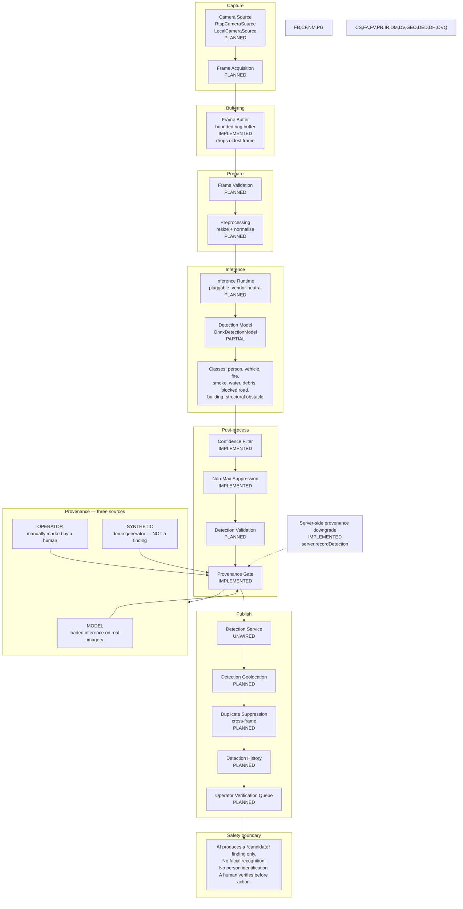

### Provenance rules

`shared/models.ts:173` defines `DetectionProvenance = "MODEL" | "SYNTHETIC" | "OPERATOR"`.

Enforced in `server.ts → recordDetection()`:

1. Synthetic generation is **off by default** (`ALLOW_SYNTHETIC=1` enables it).
2. Any provenance the server cannot vouch for is downgraded to `SYNTHETIC`.
3. `/api/detections?real=true` filters synthetic records out.
4. The console renders them with a visible `SIMULATED` tag and a standing warning.

**Why this matters operationally:** a rescuer acting on a fabricated detection
can be sent into an unsafe area, or a search for a live survivor can be called
off. The distinction must never be cosmetic.

### Detection classes

`shared/models.ts` and `vision/detection.ts → DEFAULT_CLASSES`:

`person`, `vehicle`, `building`, `debris`, `blocked_road`, `smoke`, `fire`,
`water`, `tree`, `structural_obstacle`.

Only **generic human presence** is detected. No facial recognition, no
identification, no tracking of a specific individual.

---

## 4. Safety / Failsafe Architecture

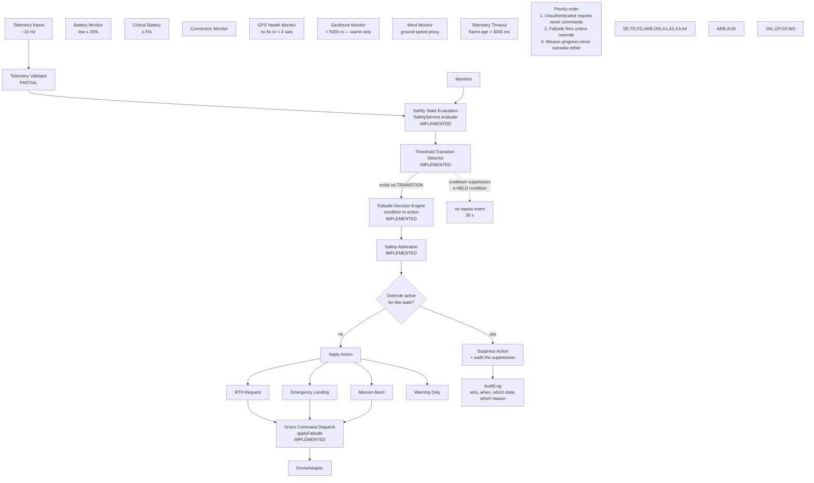

### Transitions, not repetition

A condition that stays true must **not** re-fire on every frame. A 3 % battery
at 10 Hz previously produced **4922 events in 29 seconds**, burying the console
at exactly the moment an operator most needs to read it.

Two rules together (`backend/safety_service.ts`):

| Rule | Behaviour |
|------|-----------|
| Cooldown | A *held* condition re-emits only after 30 s. |
| Transition wins | A genuine change of state **always** emits, even inside the cooldown window — otherwise the safety indicator would move with no event explaining why. |

### Thresholds

| Condition | Default | Action |
|-----------|---------|--------|
| Critical battery | ≤ 5 % | `EMERGENCY_LANDING` |
| Low battery | ≤ 20 % | `RTH_REQUESTED` |
| Link lost | `connectionState !== CONNECTED` | `MISSION_ABORT` |
| Telemetry timeout | frame age > 3000 ms | `MISSION_ABORT` |
| GPS degraded | no fix, or < 4 satellites | warning |
| Geofence | > 5000 m from home | warning — **does not prevent** |
| High wind | ground speed > 15 m/s | warning |

### Known safety limitations

- **Geofence is advisory.** It warns; it does not command a return. It will not
  stop the aircraft leaving the area.
- **Wind is a proxy.** The monitor compares `groundSpeed` against
  `maxWindSpeedMps`. Ground speed is not wind speed, so a strong wind while
  hovering reads as zero.
- **Duplicated thresholds.** `telemetry_service.ts` and `safety_service.ts` each
  define their own battery and satellite limits (20/10/5 and 4). They can drift.

---

## 5. Human Safety Authority

Suppressing an automated failsafe is the most dangerous action an operator can
take, so it is fenced in.

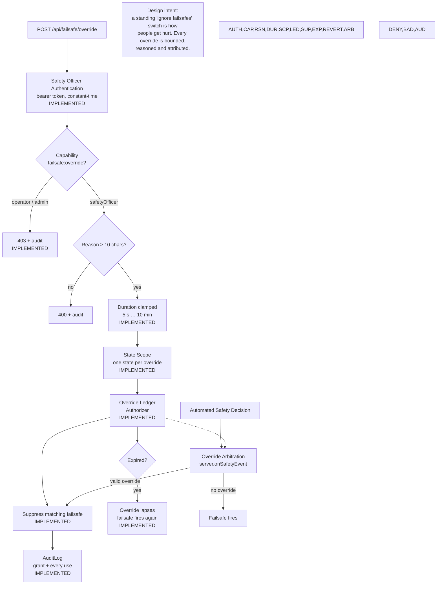

### Role separation

| Role | Mission control | Aircraft command | Failsafe override | Admin |
|------|-----------------|------------------|-------------------|-------|
| `observer` | — | — | — | — |
| `operator` | ✅ | — | — | — |
| `safetyOfficer` | ✅ | ✅ | ✅ | — |
| `admin` | — | — | — | ✅ |

Two separations are deliberate and load-bearing:

- An **operator** runs missions but cannot move the aircraft directly.
- An **admin** cannot fly anything. Managing configuration and commanding an
  aircraft are different responsibilities and are not combined.

### Auditability

Every question in §12 is answerable from the audit log: who authenticated, who
was denied, who issued a command, who granted an override, on what reason, and
when it expired.

---

## 6. Command & Authorization Architecture

No command path exists from the browser to the aircraft that skips the backend.

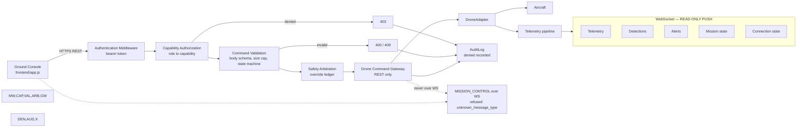

**Why commands are REST-only.** Every state change must be authorised and
audited per request. A socket that can abort a mission is a socket whose
authority is harder to bound. The server replies `unknown_message_type` to
`MISSION_CONTROL`.

**WebSocket auth** happens during the HTTP upgrade (`verifyClient`), so an
unauthenticated socket never receives aircraft state.

---

## 7. Telemetry & Communication Architecture

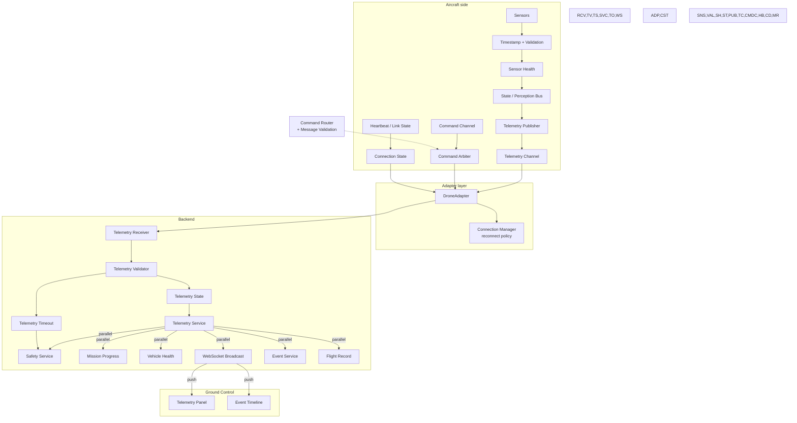

### Message validation

`backend/server.ts` enforces, on every request:

| Control | Value |
|---------|-------|
| Body size cap | 256 KB (`MAX_BODY_BYTES`) |
| Malformed JSON | `400`, server stays up |
| Missing/!string name | `400` |
| Name length | ≤ 120 characters |
| Description length | ≤ 2000 characters |
| Override reason | ≥ 10 characters |
| Override duration | clamped 5 s … 10 min |
| Static traversal | resolved and confirmed under root |

---

## 8. Ground Control Architecture

The console talks only to the backend API. It has no drone-side path.

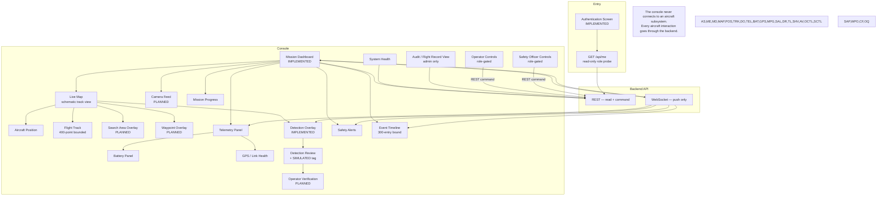

### Role-gating in the UI

Controls the signed-in role cannot use are disabled rather than left to fail
with a 403 — but the server enforces independently, so a hand-crafted request
still fails.

| Control | observer | operator | safetyOfficer |
|---------|----------|----------|---------------|
| Create / run mission | ✗ | ✓ | ✓ |
| RTH, Land | ✗ | ✗ | ✓ |
| Failsafe override | ✗ | ✗ | ✓ |
| Audit log | ✗ | ✗ | ✗ (admin) |

### Session handling

The token is held in `sessionStorage`, not `localStorage`, so closing the tab
ends the session rather than leaving a credential on a shared field laptop.

---

## 9. Simulator / Real UAV Abstraction

The central abstraction: both the real aircraft and the simulator satisfy
`DroneAdapter`, and nothing above that interface knows which is attached.

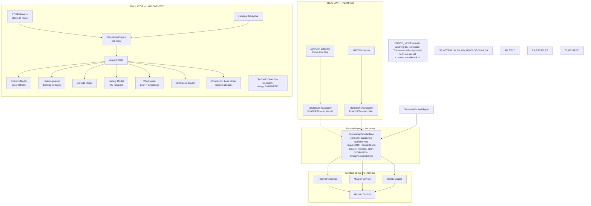

### Simulated physics

| Model | Behaviour |
|-------|-----------|
| Position | Ground track along heading at commanded speed |
| Heading | Bearing to active waypoint; set to bearing-home on RTH |
| Altitude | Tracks waypoint altitude; commanded on RTH/Land |
| Battery | `drainRatePerSecond` percentage points per second (default ~20 min pack) |
| Wind | Constant push along wind vector + bounded turbulence |
| GPS noise | Configurable metre-scale jitter |
| Connection loss | Probabilistic drop to `LOST`, auto-recovery |
| GPS noise | Configurable metre-scale jitter |

**Known gaps:** RTH never detects arrival at home — the aircraft flies over it
climbing. `requestLand()` has no ground contact and descends indefinitely.

### Simulator limitations

- **RTH does not terminate.** No arrival detection; it will fly over home and
  keep climbing.
- **Landing does not terminate.** No ground contact; descent is unbounded.
- **No scenario manager.** Failure modes are driven by randomness, not a
  scripted scenario.
- **Synthetic detections are demo-only.** Always `SYNTHETIC`, off by default.

---

## 10. Event / Audit / Flight Record

Three record classes with different purposes and different retention rules.

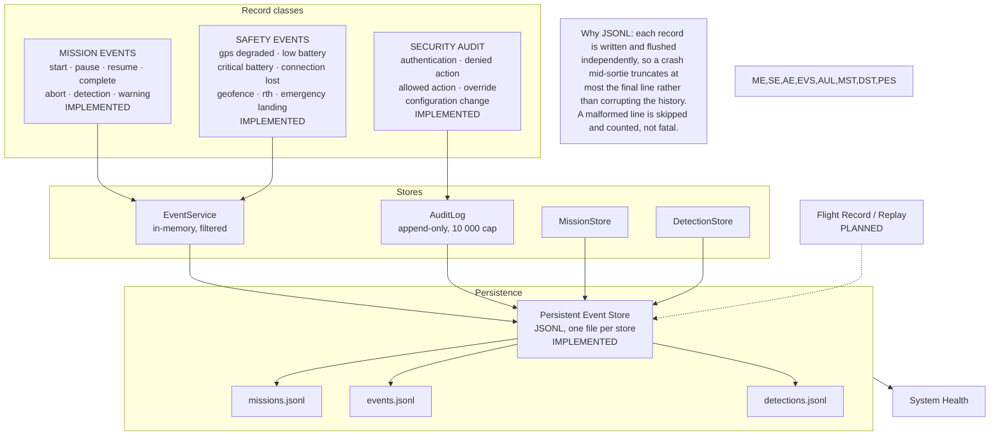

**Known gap:** `JsonlStore.append()` delegates to `put()`. "Append-only" is a
convention here, not enforced — a caller can rewrite a mission record. The audit
log is the record that matters for accountability and is held in memory only,
capped at 10 000 entries; it is **not** persisted to disk.

---

## 11. Implementation Status

Every component in the master diagram, with the file that implements it.

### Backend

| Component | Responsibility | Inputs | Outputs | Code location | Status |
|-----------|----------------|--------|---------|---------------|--------|
| HTTP Server | Bind port, serve API + console | HTTP request | HTTP response | `backend/server.ts` | `[IMPLEMENTED]` |
| WebSocket Server | Read-only push channel | WS frame | telemetry/detection/alert/event | `backend/server.ts` | `[IMPLEMENTED]` |
| Request Router | `:param` matching, dispatch | method + path | handler result | `backend/server.ts` | `[IMPLEMENTED]` |
| Authentication Middleware | Bearer token, constant-time | Authorization header | principal / 401 | `backend/auth_service.ts` | `[IMPLEMENTED]` |
| Authorization | Capability check per role | principal + capability | allow / 403 + audit | `backend/auth_service.ts` | `[IMPLEMENTED]` |
| AuditLog | Append-only action record | actor + action | `AuditEntry` | `backend/auth_service.ts` | `[IMPLEMENTED]` |
| Override Ledger | Time-boxed override state | grant / expiry | `OverrideRecord` | `backend/auth_service.ts` | `[IMPLEMENTED]` |
| Mission Service | Lifecycle + legal transitions | mission command | mission record | `backend/server.ts` | `[IMPLEMENTED]` |
| Telemetry Service | Latest frame, alerting, timeout | `Telemetry` | alerts, state | `backend/telemetry_service.ts` | `[IMPLEMENTED]` |
| Safety Service | Threshold evaluation, failsafe action | `Telemetry` | `SafetyEvent` | `backend/safety_service.ts` | `[IMPLEMENTED]` |
| Safety Arbitration | Override vs action | `SafetyEvent` | act / suppress | `backend/server.ts` | `[IMPLEMENTED]` |
| Event Service | Filterable event log | `MissionEvent` | query results | `backend/event_service.ts` | `[IMPLEMENTED]` |
| Detection Recorder | Provenance gate + persist | `Detection` | stored detection | `backend/server.ts` | `[IMPLEMENTED]` |
| Persistence Layer | JSONL stores, crash recovery, write-failure reporting | records | reloaded state | `backend/persistence.ts` | `[IMPLEMENTED]` |
| Drone Command Gateway | REST-only command path | authorised command | adapter call | `backend/server.ts` | `[IMPLEMENTED]` |
| System Health Endpoint | Derived health verdict + live counters | process state | health JSON | `backend/server.ts` | `[IMPLEMENTED]` |
| System Health Manager | Aggregate NOMINAL/DEGRADED/CRITICAL/OFFLINE/UNKNOWN | subsystem health | worst-of verdict | `backend/health_manager.ts` | `[IMPLEMENTED]` |
| Mission Manager (service) | Store-injected mission logic | mission command | mission record | `backend/mission_service.ts` | `[UNWIRED]` |
| Coverage Planner | Lawnmower pattern over a polygon | polygon + altitude | waypoints | — | `[PLANNED]` |
| Waypoint Planner | Route generation | polygon | waypoints | — | `[PLANNED]` |
| Replay / Flight Record View | Reconstruct a sortie | persisted record | timeline | — | `[PLANNED]` |

### Drone layer

| Component | Responsibility | Inputs | Outputs | Code location | Status |
|-----------|----------------|--------|---------|---------------|--------|
| DroneAdapter | Aircraft contract | commands | telemetry | `shared/models.ts` | `[IMPLEMENTED]` |
| Connection Manager | Reconnect policy | disconnect | reconnect | `drone/connection_manager.ts` | `[PARTIAL]` |
| SimulatorDroneAdapter | Hardware-free aircraft | config | telemetry | `simulator/simulator_adapter.ts` | `[IMPLEMENTED]` |
| MavlinkDroneAdapter | PX4 / ArduPilot link | UDP/TCP | telemetry | `drone/mavlink_adapter.ts` | `[PLANNED]` |
| MavsdkDroneAdapter | MAVSDK link | gRPC | telemetry | `drone/mavsdk_adapter.ts` | `[PLANNED]` |
| Telemetry Parser | MAVLink message decode | raw bytes | `Telemetry` | — | `[PLANNED]` |
| Heartbeat Monitor | Link liveness | heartbeat | connection state | — | `[PLANNED]` |
| Adapter Health | Adapter self-report | adapter state | health | — | `[PLANNED]` |

**The MAVLink and MAVSDK adapters satisfy the interface but their method bodies
are placeholders. Neither opens a socket. They would not work against a real
aircraft.**

### Vision layer

| Component | Responsibility | Inputs | Outputs | Code location | Status |
|-----------|----------------|--------|---------|---------------|--------|
| DetectionModel | Detector contract | frame | `RawDetection[]` | `vision/detection.ts` | `[IMPLEMENTED]` |
| Confidence Filter | Threshold | raw boxes | filtered | `vision/detection.ts` | `[IMPLEMENTED]` |
| Non-Max Suppression | Overlap removal | boxes | kept boxes | `vision/detection.ts` | `[IMPLEMENTED]` |
| `decodeFlatOutput` | Tensor decode | `Float32Array` | raw boxes | `vision/detection.ts` | `[IMPLEMENTED]` |
| Provenance Gate | Tag every detection | model output | tagged detection | `vision/detection.ts` | `[IMPLEMENTED]` |
| SyntheticModel | Demo generator | frame | synthetic boxes | `vision/detection.ts` | `[IMPLEMENTED]` |
| DetectionService | Pipeline + retention | frames | detections | `vision/detection.ts` | `[UNWIRED]` |
| FrameBuffer | Bounded queue, drop oldest | frames | frames | `vision/camera_pipeline.ts` | `[IMPLEMENTED]` |
| CameraSource | Camera contract | — | frames | `shared/models.ts` | `[IMPLEMENTED]` |
| RtspCameraSource | RTSP stream | RTSP URL | frames | `vision/camera_pipeline.ts` | `[PLANNED]` |
| LocalCameraSource | Local camera | device | frames | `vision/camera_pipeline.ts` | `[PLANNED]` |
| OnnxDetectionModel | ONNX inference | runtime + frame | raw boxes | `vision/detection.ts` | `[PARTIAL]` |
| InferenceRuntime | Backend binding | tensor | output tensor | `vision/detection.ts` | `[PLANNED]` |
| Preprocessing | Resize + normalise | frame | tensor | — | `[PLANNED]` |
| Detection Geolocation | Pixel → coordinate | box + pose | lat/lon | — | `[PLANNED]` |
| Duplicate Suppression | Cross-frame dedupe | detections | unique | — | `[PLANNED]` |
| Operator Verification Queue | Human confirmation | detections | verified | — | `[PLANNED]` |
| Thermal Imaging | Thermal stream | thermal device | frames | — | `[PLANNED]` |

**Camera sources report healthy stats while nothing is connected** — their
`getStats()` returns a resolution and `fps: 30` unconditionally.

### Frontend

| Component | Responsibility | Code location | Status |
|-----------|----------------|---------------|--------|
| Authentication Screen | Token entry, sign-in gate | `frontend/index.html`, `app.js` | `[IMPLEMENTED]` |
| Identity Probe | Read-only role discovery via `/api/me` | `frontend/app.js` | `[IMPLEMENTED]` |
| Mission Dashboard | Mission list + creation | `frontend/app.js` | `[IMPLEMENTED]` |
| Live Map | Schematic plan view | `frontend/app.js` | `[IMPLEMENTED]` |
| Aircraft Position | Marker + heading | `frontend/app.js` | `[IMPLEMENTED]` |
| Flight Track | Bounded 400-point history | `frontend/app.js` | `[IMPLEMENTED]` |
| Telemetry Panel | ALT/SPD/V/S/HDG/BAT/GPS/SAT/LINK | `frontend/app.js` | `[IMPLEMENTED]` |
| Battery Panel | Percentage + voltage | `frontend/app.js` | `[IMPLEMENTED]` |
| GPS / Link Health | Fix, satellites, link state | `frontend/app.js` | `[IMPLEMENTED]` |
| Detection Overlay + Review | Detections with SIMULATED tag | `frontend/app.js` | `[IMPLEMENTED]` |
| Event Timeline | Bounded 300-entry feed | `frontend/app.js` | `[IMPLEMENTED]` |
| System Health View | Health poll | `frontend/app.js` | `[IMPLEMENTED]` |
| Operator Controls | Role-gated mission actions | `frontend/app.js` | `[IMPLEMENTED]` |
| Safety Officer Controls | RTH, land, override | `frontend/app.js` | `[IMPLEMENTED]` |
| Audit View | Admin-only audit read | `frontend/app.js` | `[IMPLEMENTED]` |
| Search Area Overlay | Polygon drawing | — | `[PLANNED]` |
| Waypoint Overlay | Planned route display | — | `[PLANNED]` |
| Camera Feed View | Live video pane | — | `[PLANNED]` |
| Operator Verification UI | Confirm/discard a finding | — | `[PLANNED]` |

---

## 12. Engineering Principles

In priority order:

| # | Principle | Consequence in this system |
|---|-----------|----------------------------|
| 1 | **Human safety** | Failsafe outranks mission progress. Overrides are bounded and attributed. |
| 2 | **Correctness** | Illegal mission transitions return 409. Safety actions must be dispatchable. |
| 3 | **Explainability** | Every safety event carries a reason; every detection carries provenance. |
| 4 | **Auditability** | Allowed *and* denied actions are recorded with actor, time and outcome. |
| 5 | **Reliability** | A held safety condition does not flood the log; a crash truncates one line, not the record. |
| 6 | **Maintainability** | Interfaces at every seam; the console runs with no build step. |
| 7 | **Performance** | Bounded buffers and retention everywhere; the vision path never blocks telemetry. |

### Post-incident questions

Each of these must be answerable from the persisted record and the audit log:

| Question | Answered by |
|----------|-------------|
| Why did the drone return to home? | Safety event with battery threshold and description |
| Why was the mission aborted? | Mission event + safety event + `applyFailsafe` audit entry |
| Did the detection come from a model, an operator, or the simulator? | `Detection.provenance` |
| Which safety state triggered? | `SafetyEvent.state` |
| Who issued the command? | `AuditEntry.actorUsername` + `actorRole` |
| Was the command accepted? | `AuditEntry.outcome` |
| Why was it rejected? | `AuditEntry.detail.reason` on a `denied` entry |
| Who overrode the failsafe, and why? | `OverrideRecord` + `failsafe.override.grant` audit |
| When did the override expire? | `OverrideRecord.expiresAt` |

---

## 13. Principal Data Flows

### A. Rescue detection

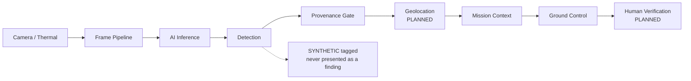

### B. Flight safety

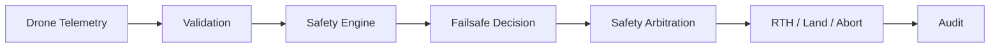

### C. Mission control

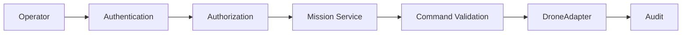

### D. Recording

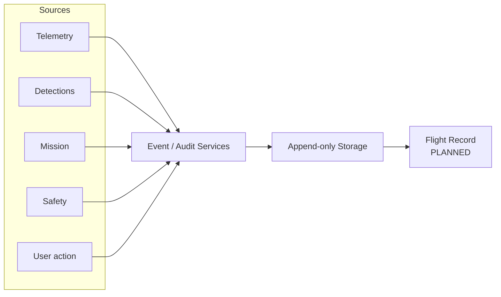

---

## 14. Failure & Recovery Architecture

A rescue console is used when something is going wrong. The nominal flow is the
easy half; what matters is what happens when a subsystem fails mid-sortie.

Every failure below follows the same chain:

```
detect → classify → notify → safe fallback → log
```

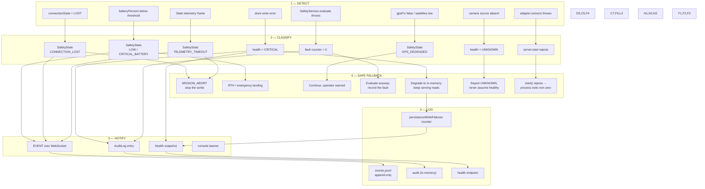

### Failure matrix

| Failure | Detected by | Classification | Fallback | Logged | Status |
|---------|-------------|----------------|----------|--------|--------|
| Telemetry stops | Frame age vs `telemetryTimeoutMs` | `TELEMETRY_TIMEOUT` | `MISSION_ABORT` | event + audit | `[IMPLEMENTED]` |
| Link lost | `connectionState !== CONNECTED` | `CONNECTION_LOST` | `MISSION_ABORT` | event + audit | `[IMPLEMENTED]` |
| Low battery | `batteryPercent <= 20` | `LOW_BATTERY_WARNING` | `RTH_REQUESTED` | event + audit | `[IMPLEMENTED]` |
| Critical battery | `batteryPercent <= 5` | `CRITICAL_BATTERY` | `EMERGENCY_LANDING` | event + audit | `[IMPLEMENTED]` |
| GPS degraded | `!gpsFix` or `satellites < 4` | `GPS_DEGRADED` | warning only | event | `[IMPLEMENTED]` |
| Geofence breach | `distanceFromHome > 5000 m` | `GEOFENCE_WARNING` | **warning only — does not prevent** | event | `[PARTIAL]` |
| High wind | `groundSpeed > 15 m/s` | `HIGH_WIND_WARNING` | warning only (ground speed is a proxy) | event | `[PARTIAL]` |
| Safety engine throws | `try/catch` around `evaluate()` | fault counter | keep evaluating; surface as CRITICAL | audit + `SAFETY_ENGINE_FAULT` | `[IMPLEMENTED]` |
| Store write fails | `stream.on("error")` / `write` throw | `writeFailures` | degrade to in-memory; keep serving reads | health `CRITICAL` | `[IMPLEMENTED]` |
| Unwritable `DATA_DIR` | `mkdirSync` in constructor throws | `degradedReason` | fall back to memory instead of crashing at boot | health `CRITICAL` | `[IMPLEMENTED]` |
| Camera absent | `cameraActive === undefined` | health `UNKNOWN` | report UNKNOWN, never NOMINAL | health snapshot | `[IMPLEMENTED]` |
| Vision model absent | `visionModelLoaded === undefined` | health `UNKNOWN` | report UNKNOWN | health snapshot | `[IMPLEMENTED]` |
| Adapter connect fails | `await adapter.connect()` in `start()` | start rejects | process exits non-zero; no half-open console | stderr | `[IMPLEMENTED]` |
| Camera lost mid-stream | — | — | **no detector** | — | `[PLANNED]` |
| Vision runtime crash | — | — | **no detector** | — | `[PLANNED]` |
| Mission geometry invalid | — | name/length checks only | **no geometry validation** | — | `[PLANNED]` |

### Failures with no detector

Stated plainly, because these are the gaps that would matter in service:

- **Camera lost mid-stream.** No camera is wired to the server, so there is
  nothing to detect the loss of. When one is added it needs its own watchdog;
  the camera sources in `vision/` currently report a resolution and `fps: 30`
  unconditionally, including while nothing is connected.
- **Vision inference crash.** The inference path is not wired to the server, so
  there is no process to supervise.
- **Invalid mission geometry.** Mission creation validates the name and
  description only. No polygon, altitude or battery-feasibility check exists,
  because no planner exists.

---

## 15. System Health & Single Points of Failure

### Health aggregation

`backend/health_manager.ts` folds ten subsystems into one verdict.

| Status | Meaning |
|--------|---------|
| `NOMINAL` | Measured, and within limits. |
| `UNKNOWN` | Not measured. **Never treated as nominal.** |
| `DEGRADED` | Measured, impaired but usable. |
| `CRITICAL` | Measured, unsafe or losing data. |
| `OFFLINE` | Measured, not functioning. |

Worst-wins ordering: `OFFLINE > CRITICAL > DEGRADED > UNKNOWN > NOMINAL`.

`UNKNOWN` sits **below** `DEGRADED` deliberately. An unmeasured subsystem is a
problem to resolve; one measured and found impaired is more urgent.

In the shipped configuration the console reports `UNKNOWN`, because no camera
source and no vision model are wired. That is the honest verdict, and it is
what `/healthz` returns. It is not a bug.

### Single points of failure

| SPOF | Consequence | Current mitigation | Status |
|------|-------------|--------------------|--------|
| **Single Node process** | Crash loses all console state and the audit log | none — no clustering, no supervisor | `[PARTIAL]` |
| **Audit log is in-memory** | Restart erases who-did-what | none — not written to disk | `[PLANNED]` |
| **No persistence retry** | A transient write failure drops a record permanently | counter surfaces it; no retry | `[PARTIAL]` |
| **Safety engine runs in-process** | If the process dies, the failsafe stops with it | adapter continues its own failsafe only if the real adapter implements one — the simulator does not | `[PARTIAL]` |
| **`TelemetryService` and `SafetyService` share a process** | A hang in one stalls both | telemetry dispatch is synchronous and unguarded between the two | `[PARTIAL]` |
| **No watchdog restarts the console** | A crash ends the session silently | process supervisor is a deployment concern | `[PLANNED]` |
| **Single safety officer can suppress a failsafe** | One person can overrule automation | reason required, time-boxed, audited | `[IMPLEMENTED]` |

**The most important line in this table:** the safety engine has no process
isolation. It is a function call inside the same event loop as everything else.
A blocking call anywhere on that loop stalls the failsafe. `onSafetyFrame` is
wrapped against *throwing*, but not against *blocking*.

---

## 16. Validation Status

No claim of flight-readiness is made. Real aircraft use requires, at minimum:
simulation, then HIL/SIL against the real autopilot, then field trials, and
independent verification by a qualified engineer.

### Verified by test

| Requirement | Test |
|-------------|------|
| Failsafe fires on critical battery | `unit.test.ts` — "critical battery demands an immediate action" |
| Failsafe fires on link loss | `unit.test.ts` — "lost connection is critical and produces a dispatchable action" |
| Failsafe fires on stale telemetry | `unit.test.ts` — "stale telemetry raises TELEMETRY_TIMEOUT" |
| A held condition does not flood the log | `unit.test.ts` — "a held condition does not re-emit on every frame" |
| A transition is never swallowed | `unit.test.ts` — "a genuine transition is never swallowed by the repeat cooldown" |
| Anonymous WebSocket refused | `integration.test.ts` — "an unauthenticated socket is refused during the handshake" |
| Role separation enforced server-side | `integration.test.ts` — authorisation suite |
| Admin cannot fly | `integration.test.ts` — "an admin does not inherit flight authority" |
| Override requires reason and role | `integration.test.ts` — failsafe override suite |
| Illegal mission transition rejected | `integration.test.ts` — "an illegal transition is refused with 409" |
| Audit survives restart | `integration.test.ts` — "missions and events survive a restart" |
| Synthetic detections never masquerade | `unit.test.ts`, `integration.test.ts` — provenance suites |
| UNKNOWN is not NOMINAL | `health.test.ts` — full suite |
| RTH terminates at home | `unit.test.ts` — "RTH terminates on arrival at home" |
| Landing terminates at ground | `unit.test.ts` — "landing terminates at ground level" |
| Failure conditions are provokable | `unit.test.ts` — "simulator fault injection" |

### Unverified assumptions

These are believed but **not proven**. Each is a place where the architecture
could be wrong in a way tests would not catch.

| Assumption | Why it is unverified | How to verify |
|------------|----------------------|---------------|
| A real autopilot honours `requestRTH()` / `requestLand()` | No MAVLink transport exists to send them | HIL against PX4 / ArduPilot |
| Battery percentage maps to real endurance | The drain model is a linear constant | Bench discharge curve |
| 30 s repeat cooldown suits real flight | Chosen by judgement, not measurement | Flight trials |
| Threshold values (20 %, 5 %, 5000 m, 15 m/s) are appropriate | Defaults, not derived from an SOP | Mission risk assessment |
| Geofence as a warning is sufficient | It does not prevent anything | Risk assessment; likely needs enforcement |
| Ground speed is an acceptable wind proxy | It is not a wind measurement | Add a real wind sensor |
| Constant-time token comparison resists timing attack | Correct construction, never attacked | External security review |
| Node's event loop stays responsive under load | Untested under real telemetry volume | Load test at target frame rate |
| `JSONL` survives power loss mid-write | Designed for it; never power-cycled | Kill -9 during a write, then read |
| The audit log being in-memory is acceptable | A convenience decision | Product and compliance decision |

### Recommended next validation steps

1. **Scenario tests in the digital twin.** The fault-injection API added in
   this round (`setBattery`, `setGpsQuality`, `dropLink`,
   `freezeTelemetryTimestamp`) exists so every safety rule can be provoked
   deliberately. Write one scenario per safety rule.
2. **Replay.** Persist telemetry at full rate, then re-run a sortie through the
   safety engine and assert the same actions. Currently the event log records
   decisions, not the inputs.
3. **HIL.** Connect a real autopilot over MAVLink and repeat the safety suite
   against it. The safety logic is transport-agnostic; the transport is the
   unproven part.
4. **Independent safety review** of `SafetyService` and `Authorizer` by someone
   who did not write them.
5. **Persistence durability test** — power-loss simulation, not clean shutdown.

---

## 17. Security Boundary

RescueEye is a rescue, disaster-response and situational-awareness platform.

**Not implemented, and not to be added:**

- Weapons, weapon control, ammunition or explosive payload
- Target selection or autonomous engagement
- Facial recognition, biometric identification, person identification
- Behaviour intended to harm people or property
- Countermeasures, RF evasion, or communications jamming

Computer vision exists to locate things a rescuer needs to find — people,
vehicles, fire, smoke, water, debris and obstacles. It produces a *candidate*
finding. A human decides what to act on.

---

## 18. Deployment Notes

- Bind `127.0.0.1` unless the network is trusted; terminate TLS and proxy the
  WebSocket if exposed beyond localhost.
- Provision operator accounts out of band for real use. The startup banner is a
  development convenience.
- `DATA_DIR` should be durable storage — the event log is the flight record.
- `ALLOW_SYNTHETIC` must stay unset outside demos.
- Audit log is in-memory only. Export it if it must survive a restart.
- Run under a supervisor. A single process is a single point of failure (§15).
- `/healthz` returns `UNKNOWN` in the shipped configuration. That is correct
  behaviour, not a fault — see §15.
